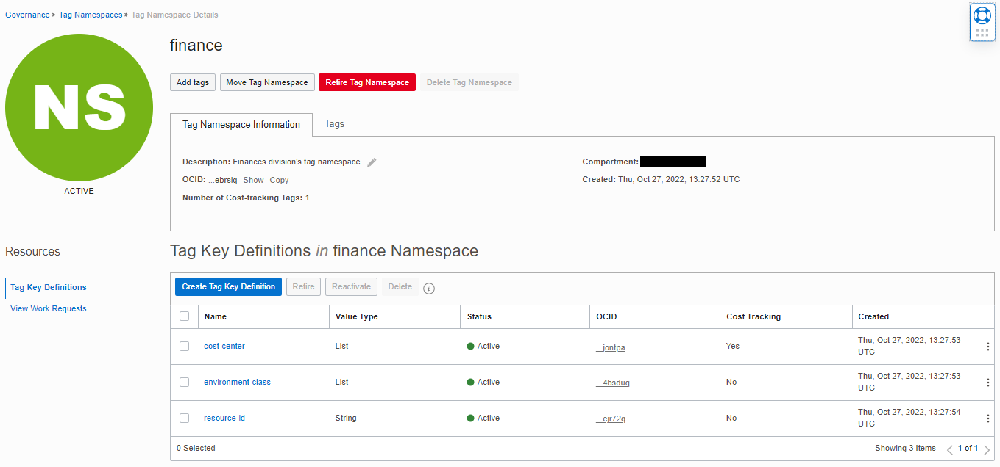
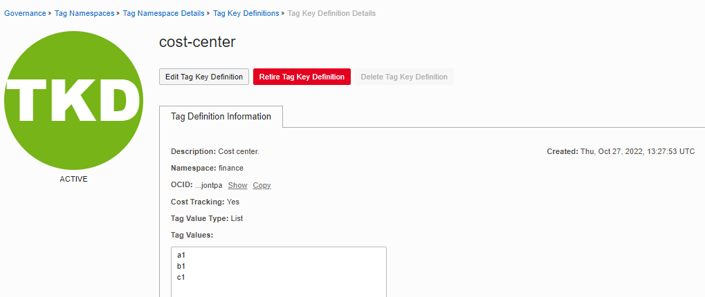
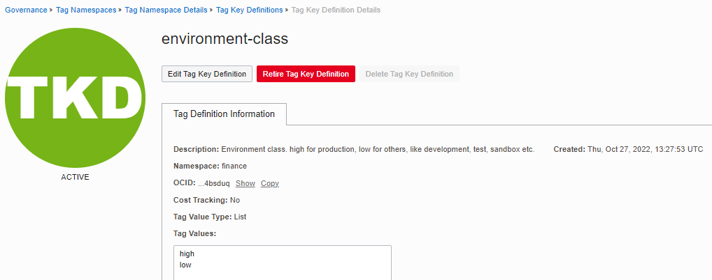
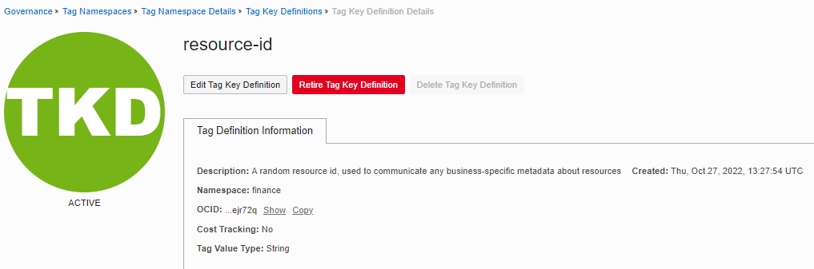

# OCI IAM Tags Module Example - Finance Division Tags

## Introduction

This example shows how to manage defined tags in Oracle Cloud Infrastructure.

The following resources are created in this example:

- One tag namespace: finance.
- Three tags: cost-center, environment-class, resource-id.
- No tag defaults.

Here's how these resources appear in OCI Console:









## Using this example
1. Prepare one variable file named *terraform.tfvars* with the required information for authenticating to OCI. The contents of *terraform.tfvars* should look something like the following (or copy and re-use the contents of *terraform.tfvars.template*):

```
### TENANCY DETAILS
#
# Get this from OCI Console (after logging in, go to top-right-most menu item and click option "Tenancy: <your tenancy name>").
tenancy_id="<tenancy OCID>"
#
# Get this from OCI Console (after logging in, go to top-right-most menu item and click option "My profile").
user_id="<user OCID>"
#
# The fingerprint can be gathered from your user account. In the "My profile page, click "API keys" on the menu in left hand side).
fingerprint="<PEM key fingerprint>"
#
# This is the full path on your local system to the private key used for the API signing key pair.
private_key_path="<path to the private key that matches the fingerprint above>"
#
# This is the password that protects the private key, if any.
private_key_password=""
#
# This is your tenancy home region.
home_region="<your tenancy home region>"
```

2. Check the provided *input.auto.tfvars* file. It has a single variable named *defined_tags*:

```
defined_tags = {  
  FINANCE-NAMESPACE  : { 
    compartment_id : null,
    namespace_name : "finance",  
    namespace_description : "Finances division's tag namespace.",    
    is_namespace_retired : false,  
    defined_tags : null,
    freeform_tags : null
    tags : {
      COST-CENTER-TAG : {
        name : "cost-center",
        description : "Cost center.",
        is_cost_tracking : true,
        is_retired : false,
        valid_values : ["a1","b1","c1"] # tag values are checked against these values upon resource tagging.
        apply_default_to_compartments : null, # ["ocid1","ocid2","ocidN"] Optional, provide a list of compartment ocids where you want to apply the default_value.
        default_value : null,
        is_default_required : true,
        defined_tags : null,
        freeform_tags : null                
      },
      ENVIRONMENT-TAG : {
        name : "environment-class",
        description : "Environment class. high for production, low for others, like development, test, sandbox etc.",
        is_cost_tracking : false,
        is_retired : false,
        valid_values : ["high","low"], # tag values are checked against these values upon resource tagging.
        apply_default_to_compartments : null, # ["ocid1","ocid2","ocidN"] Optional, provide a list of compartment ocids where you want to apply the default_value.
        default_value : null,
        is_default_required : true,
        defined_tags : null,
        freeform_tags : null 
      },
      RESOURCE-ID-TAG : {
        name : "resource-id",
        description : "A random resource id, used to communicate any business-specific metadata about resources",
        is_cost_tracking : false,
        is_retired : false,
        valid_values : null, # no checks upon resource tagging
        apply_default_to_compartments : null, # ["ocid1","ocid2","ocidN"] Optional, provide a list of compartment ocids where you want to apply the default_value.
        default_value : null,
        is_default_required : true,
        defined_tags : null,
        freeform_tags : null 
      }
    } 
  }
}  
```

3. Check the provided *main.tf* file. It calls the underlying tags module for resource management.

`main.tf`:

```
module "cislz_tags" {
  source                         = "../../"
  tenancy_id                     = var.tenancy_id

  #-- Enabling tag namespace required by CIS
  enable_cislz_namespace         = true
  cislz_namespace_compartment_id = var.tenancy_id
  cislz_freeform_tags            = {"cis-landing-zone":"cislz"}

  #-- The map of defined tags to manage 
  defined_tags = var.defined_tags
}

```

4. Then execute the example using the usual Terraform workflow:

```
$ terraform init
$ terraform plan
$ terraform apply
```